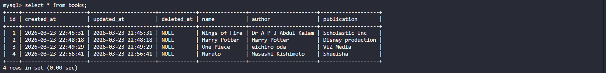
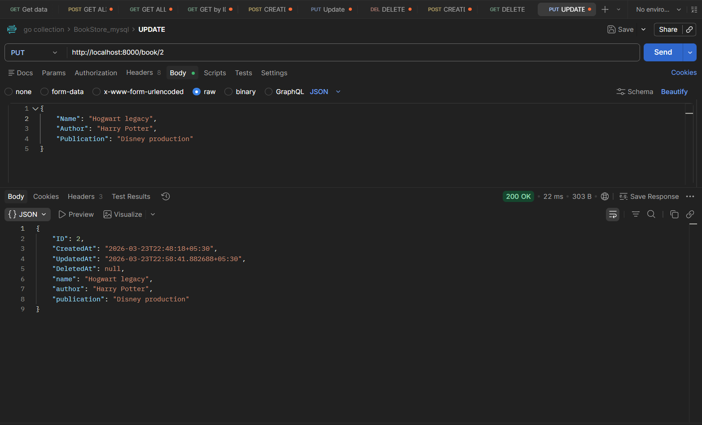
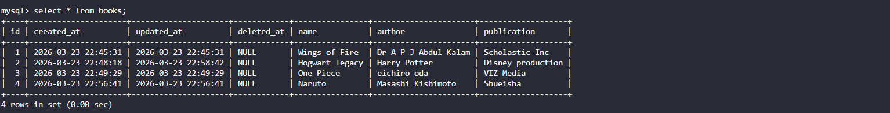

# 📚 BookStore API — MySQL + GORM

A full-featured Book Management REST API built with **Go**, **Gorilla Mux**, **GORM ORM**, and **MySQL**. Follows a clean, modular package structure separating concerns into config, models, controllers, routes, and utils.

---

## Project Structure

```
                           ┌──────────┐
                           │   PKG    │
                           └────┬─────┘
                                │
     ┌──────────────┬───────────┼───────────┬───────────┬───────────┐
     ▼              ▼           ▼           ▼           ▼           ▼

┌──────────┐   ┌──────────┐  ┌──────────────┐  ┌──────────┐  ┌──────────┐  ┌──────────┐
│   CMD    │   │  config  │  │ controllers  │  │  models  │  │  routes  │  │  utils   │
└────┬─────┘   └────┬─────┘  └──────┬───────┘  └────┬─────┘  └────┬─────┘  └────┬─────┘
     │              │               │               │             │             │
     ▼              ▼               ▼               ▼             ▼             ▼

┌──────────┐   ┌──────────┐  ┌────────────────┐  ┌──────────┐  ┌────────────────┐  ┌──────────┐
│ main.go  │   │  app.go  │  │book-controller │  │  book.go │  │bookstore-routes│  │ utils.go │
└──────────┘   └──────────┘  └────────────────┘  └──────────┘  └────────────────┘  └──────────┘
```

| Package       | File                  | Responsibility                                          |
| ------------- | --------------------- | ------------------------------------------------------- |
| `cmd`         | `main.go`             | Entry point — starts the server on port 8000            |
| `config`      | `app.go`              | MySQL database connection via GORM                      |
| `controllers` | `book-controller.go`  | HTTP handlers for all CRUD operations                   |
| `models`      | `book.go`             | Book struct, DB auto-migration, and data access methods |
| `routes`      | `bookstore-routes.go` | Route registration — maps URLs to controllers           |
| `utils`       | `utils.go`            | Helper to parse JSON request body                       |

---

## API Routes & Controller Functions

```
┌──────────────────┐     ┌──────────────┐     ┌────────────┐
│   CREATE BOOK    │◀────│    /book/    │◀────│    POST    │
└──────────────────┘     └──────────────┘     └────────────┘

┌──────────────────┐     ┌──────────────┐     ┌────────────┐
│   GET ALL BOOKS  │◀────│    /book/    │◀────│    GET     │
└──────────────────┘     └──────────────┘     └────────────┘

┌──────────────────┐     ┌────────────────────┐     ┌────────────┐
│ GET BOOK BY ID   │◀────│ /book/{bookId}     │◀────│    GET     │
└──────────────────┘     └────────────────────┘     └────────────┘

┌──────────────────┐     ┌────────────────────┐     ┌────────────┐
│   UPDATE BOOK    │◀────│ /book/{bookId}     │◀────│    PUT     │
└──────────────────┘     └────────────────────┘     └────────────┘

┌──────────────────┐     ┌────────────────────┐     ┌────────────┐
│   DELETE BOOK    │◀────│ /book/{bookId}     │◀────│   DELETE   │
└──────────────────┘     └────────────────────┘     └────────────┘
```

| Method   | Endpoint         | Controller    | Description         |
| -------- | ---------------- | ------------- | ------------------- |
| `POST`   | `/book/`         | `CreateBook`  | Add a new book      |
| `GET`    | `/book/`         | `GetBook`     | Fetch all books     |
| `GET`    | `/book/{bookId}` | `GetBookById` | Fetch a single book |
| `PUT`    | `/book/{bookId}` | `UpdateBook`  | Update book details |
| `DELETE` | `/book/{bookId}` | `DeleteBook`  | Remove a book       |

---

## Key Code Explained

### Database Connection — `pkg/config/app.go`

```go
func Connect() {
    d, err := gorm.Open("mysql",
        "root:password@tcp(127.0.0.1:3306)/go_bookstore?charset=utf8mb4&parseTime=True&loc=Local")
    if err != nil {
        panic(err)
    }
    db = d
}

func GetDB() *gorm.DB {
    return db
}
```

- Uses **GORM** ORM to connect to MySQL
- Connection string format: `user:password@tcp(host:port)/dbname`
- `GetDB()` exposes the DB instance to other packages

### Book Model — `pkg/models/book.go`

```go
type Book struct {
    gorm.Model                              // adds ID, CreatedAt, UpdatedAt, DeletedAt
    Name        string `json:"name"`
    Author      string `json:"author"`
    Publication string `json:"publication"`
}

func init() {
    config.Connect()
    db = config.GetDB()
    db.AutoMigrate(&Book{})                 // auto-creates the table in MySQL
}
```

- `gorm.Model` embeds ID, timestamps, and soft-delete fields automatically
- `db.AutoMigrate(&Book{})` creates/updates the `books` table on startup
- Model methods (`CreateBook`, `GetAllBooks`, `GetBookById`, `DeleteBook`) handle all DB operations

### Update Controller — `pkg/controllers/book-controller.go`

```go
func UpdateBook(w http.ResponseWriter, r *http.Request) {
    var updateBook = &models.Book{}
    utils.ParseBody(r, updateBook)               // parse request body
    bookDetails, db := models.GetBookById(ID)    // fetch existing book

    if updateBook.Name != "" {                   // only update non-empty fields
        bookDetails.Name = updateBook.Name
    }
    if updateBook.Author != "" {
        bookDetails.Author = updateBook.Author
    }
    if updateBook.Publication != "" {
        bookDetails.Publication = updateBook.Publication
    }
    db.Save(&bookDetails)                        // save to MySQL
}
```

- **Partial updates** — only overwrites fields that are sent in the request body
- Uses GORM's `.Save()` to persist changes

### Request Body Parser — `pkg/utils/utils.go`

```go
func ParseBody(r *http.Request, x interface{}) {
    body, _ := io.ReadAll(r.Body)
    json.Unmarshal(body, x)
}
```

- Reads the raw request body and unmarshals JSON into any struct (using `interface{}`)
- Reusable across all controllers

---

## Postman API Testing

### Initial Data — GET All Books


### Database After Setup



### Create a New Book


### Update a Book



### Database After Update



### Delete a Book


### After Deletion — API Response


### After Deletion — Database View


---

## Prerequisites

- **Go** 1.22+
- **MySQL** server running on `localhost:3306`
- Create a database named `go_bookstore`:
  ```sql
  CREATE DATABASE go_bookstore;
  ```
- Update the MySQL credentials in `pkg/config/app.go` if needed

## How to Run

```bash
cd Projects/BookStore_mysql

# Install dependencies
go mod tidy

# Run the server
go run cmd/main.go
# Server starts at http://localhost:8000
```

## Dependencies

| Package                                                         | Purpose                           |
| --------------------------------------------------------------- | --------------------------------- |
| [`gorilla/mux`](https://github.com/gorilla/mux)                 | HTTP router with path variables   |
| [`jinzhu/gorm`](https://github.com/jinzhu/gorm)                 | ORM for MySQL database operations |
| [`go-sql-driver/mysql`](https://github.com/go-sql-driver/mysql) | MySQL driver for Go               |
