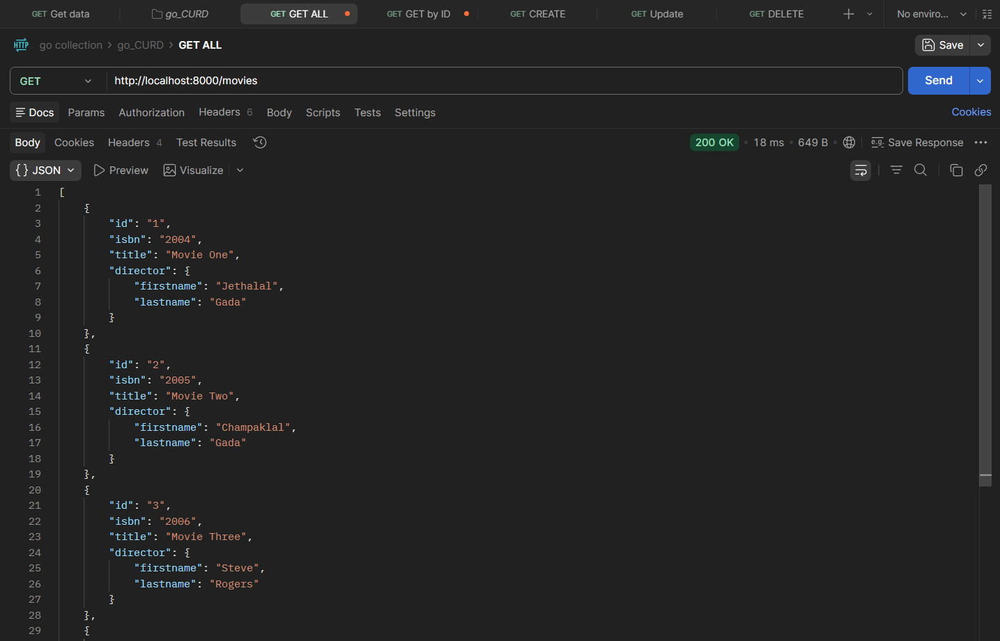
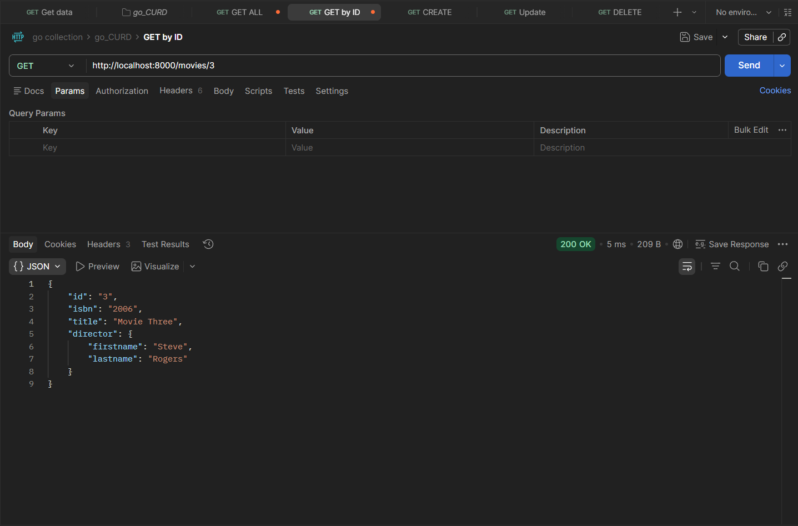
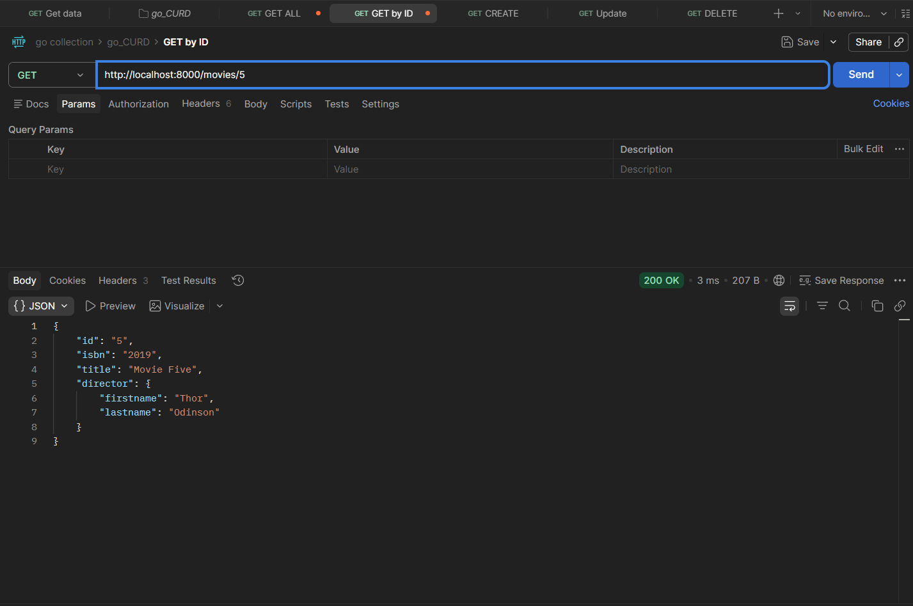
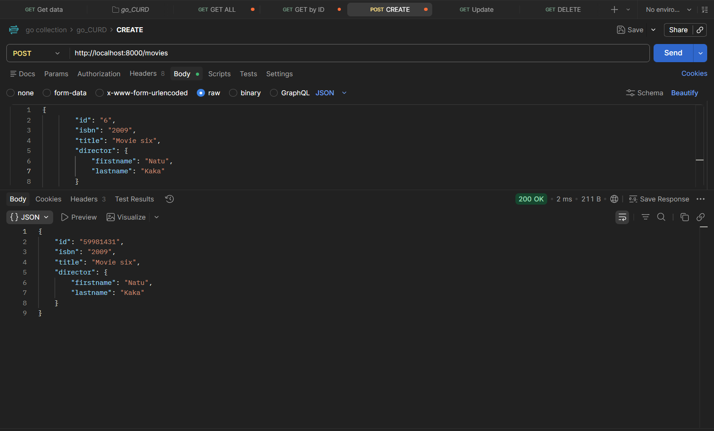
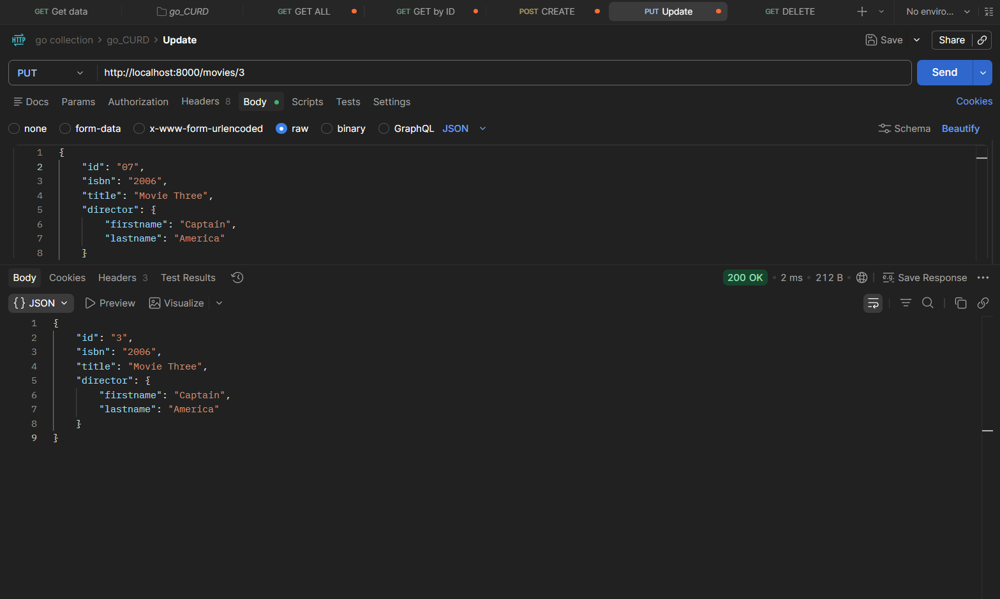
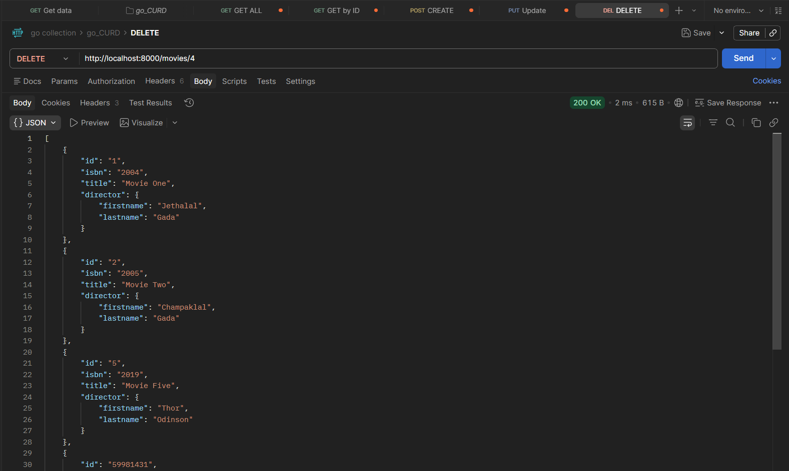

# 🎬 CRUD API — Movies

A RESTful CRUD API built with Go and [Gorilla Mux](https://github.com/gorilla/mux) for managing movies. Uses in-memory storage (no database) — perfect for learning REST API fundamentals in Go.

---

## Architecture

```
                       ROUTES              FUNCTIONS            ENDPOINTS            METHODS
                    ┌──────────────┐    ┌──────────────┐    ┌──────────────┐     ┌──────────────┐
                    │   GET ALL    │───▶│  getMovies   │───▶│   /movies    │───▶│     GET      │──┐
                    └──────────────┘    └──────────────┘    └──────────────┘     └──────────────┘   │
                                                                                                    │
                    ┌──────────────┐    ┌──────────────┐    ┌──────────────┐     ┌──────────────┐   │
                    │  GET BY ID   │───▶│  getMovie    │───▶│ /movies/{id} │───▶│     GET      │──┤
                    └──────────────┘    └──────────────┘    └──────────────┘     └──────────────┘   │
    ┌──────────┐                                                                                    │
    │  Gorilla │    ┌──────────────┐    ┌──────────────┐    ┌──────────────┐     ┌──────────────┐   │     ┌──────────┐
    │   Mux    │    │    CREATE    │───▶│ createMovie  │───▶│   /movies    │───▶│     POST     │──┼──▶  │ Postman  │
    └──────────┘    └──────────────┘    └──────────────┘    └──────────────┘     └──────────────┘   │     └──────────┘        
                                                                                                    │
                    ┌──────────────┐    ┌──────────────┐    ┌──────────────┐     ┌──────────────┐   │
                    │    UPDATE    │───▶│ updateMovie  │───▶│ /movies/{id} │───▶│     PUT      │──┤
                    └──────────────┘    └──────────────┘    └──────────────┘     └──────────────┘   │
                                                                                                    │
                    ┌──────────────┐    ┌──────────────┐    ┌──────────────┐     ┌──────────────┐   │
                    │    DELETE    │───▶│ deleteMovie  │───▶│ /movies/{id} │───▶│   DELETE     │──┘
                    └──────────────┘    └──────────────┘    └──────────────┘     └──────────────┘
```

---

## API Endpoints

| Method   | Endpoint       | Description              |
| -------- | -------------- | ------------------------ |
| `GET`    | `/movies`      | Get all movies           |
| `GET`    | `/movies/{id}` | Get a single movie by ID |
| `POST`   | `/movies`      | Create a new movie       |
| `PUT`    | `/movies/{id}` | Update a movie by ID     |
| `DELETE` | `/movies/{id}` | Delete a movie by ID     |

---

## Project Structure

```
CRUD_API/
├── main.go          # All API logic (handlers, models, routes)
├── go.mod           # Module definition (gorilla/mux dependency)
├── go.sum           # Dependency checksums
└── assets/          # Postman API test screenshots
```

---

## Data Models

```go
type Movie struct {
    ID       string    `json:"id"`
    Isbn     string    `json:"isbn"`
    Title    string    `json:"title"`
    Director *Director `json:"director"`
}

type Director struct {
    Firstname string `json:"firstname"`
    Lastname  string `json:"lastname"`
}
```

- **JSON tags** (`json:"id"`) control how struct fields appear in API responses
- `Director` is a **pointer** (`*Director`) — allows nested JSON objects
- Movies are stored in a **slice** (`var movies []Movie`) — in-memory, resets on restart

---

## Key Code Explained

### Route Setup with Gorilla Mux

```go
r := mux.NewRouter()
r.HandleFunc("/movies", getMovies).Methods("GET")
r.HandleFunc("/movies/{id}", getMovie).Methods("GET")
r.HandleFunc("/movies", createMovie).Methods("POST")
r.HandleFunc("/movies/{id}", updateMovie).Methods("PUT")
r.HandleFunc("/movies/{id}", deleteMovie).Methods("DELETE")

http.ListenAndServe(":8000", r)
```

- `mux.NewRouter()` creates a router that supports **path variables** like `{id}`
- `.Methods("GET")` restricts a route to specific HTTP methods
- `mux.Vars(r)` extracts path variables: `params := mux.Vars(r)` → `params["id"]`

### GET All Movies

```go
func getMovies(w http.ResponseWriter, r *http.Request) {
    w.Header().Set("Content-Type", "application/json")
    json.NewEncoder(w).Encode(movies)
}
```

- `json.NewEncoder(w).Encode(movies)` — converts the slice to JSON and writes it to the response

### CREATE Movie

```go
func createMovie(w http.ResponseWriter, r *http.Request) {
    var movie Movie
    json.NewDecoder(r.Body).Decode(&movie)        // read JSON body into struct
    movie.ID = strconv.Itoa(rand.Intn(100000000)) // generate random ID
    movies = append(movies, movie)                 // add to slice
    json.NewEncoder(w).Encode(movie)               // return created movie
}
```

- `json.NewDecoder(r.Body).Decode(&movie)` — parses the request body JSON into a `Movie` struct
- Random ID is generated using `math/rand`

### UPDATE Movie

```go
func updateMovie(w http.ResponseWriter, r *http.Request) {
    params := mux.Vars(r)
    for index, item := range movies {
        if item.ID == params["id"] {
            movies = append(movies[:index], movies[index+1:]...) // delete old
            var movie Movie
            json.NewDecoder(r.Body).Decode(&movie)
            movie.ID = params["id"]                              // keep same ID
            movies = append(movies, movie)                       // add updated
            json.NewEncoder(w).Encode(movie)
        }
    }
}
```

- Strategy: **delete the old → add the new** with the same ID

### DELETE Movie

```go
func deleteMovie(w http.ResponseWriter, r *http.Request) {
    params := mux.Vars(r)
    for index, item := range movies {
        if item.ID == params["id"] {
            movies = append(movies[:index], movies[index+1:]...) // remove by index
            break
        }
    }
    json.NewEncoder(w).Encode(movies)
}
```

- `movies[:index]` + `movies[index+1:]...` — classic slice trick to remove an element by index

---

## Postman API Testing

### GET All Movies



### GET Movie by ID





### CREATE Movie



### UPDATE Movie



### DELETE Movie



---

## How to Run

```bash
cd Projects/CRUD_API

# Install dependencies
go mod tidy

# Run the server
go run main.go
# Server starts at localhost:8000
```

Then test with Postman or curl:

```bash
# Get all movies
curl http://localhost:8000/movies

# Get movie by ID
curl http://localhost:8000/movies/1

# Create a movie
curl -X POST http://localhost:8000/movies \
  -H "Content-Type: application/json" \
  -d '{"isbn":"2025","title":"New Movie","director":{"firstname":"John","lastname":"Doe"}}'

# Update a movie
curl -X PUT http://localhost:8000/movies/1 \
  -H "Content-Type: application/json" \
  -d '{"isbn":"2025","title":"Updated Movie","director":{"firstname":"Jane","lastname":"Doe"}}'

# Delete a movie
curl -X DELETE http://localhost:8000/movies/1
```

---

## Dependencies

| Package                                         | Purpose                                                |
| ----------------------------------------------- | ------------------------------------------------------ |
| [`gorilla/mux`](https://github.com/gorilla/mux) | HTTP router with path variables & method-based routing |
| `encoding/json`                                 | JSON encoding/decoding (standard library)              |
| `math/rand`                                     | Random ID generation (standard library)                |
