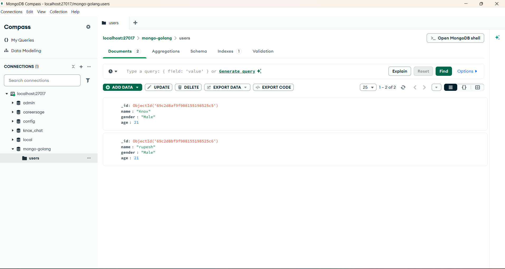

# 🍃 MongoDB User API

A User Management REST API built with **Go**, **httprouter**, and the official **MongoDB Go Driver**. Supports creating, fetching, and deleting users stored in a MongoDB database.

---

## API Endpoints

| Method   | Endpoint    | Description               |
| -------- | ----------- | ------------------------- |
| `GET`    | `/user/:id` | Get a user by ObjectID    |
| `POST`   | `/user`     | Create a new user         |
| `DELETE` | `/user/:id` | Delete a user by ObjectID |

---

## Project Structure

```
MongoDB_API/
├── main.go              # Entry point — server setup & MongoDB connection
├── controllers/
│   └── user.go          # HTTP handlers (GetUser, CreateUser, DeleteUser)
├── models/
│   └── user.go          # User struct with JSON + BSON tags
├── go.mod               # Dependencies
└── assets/              # Postman API test screenshots
```

---

## Data Model

```go
type User struct {
    Id     primitive.ObjectID `json:"id" bson:"_id,omitempty"`
    Name   string            `json:"name" bson:"name"`
    Gender string            `json:"gender" bson:"gender"`
    Age    int               `json:"age" bson:"age"`
}
```

- `primitive.ObjectID` — MongoDB's unique ID type (24-char hex string)
- **Two sets of tags:**
  - `json:"name"` — controls JSON API response field names
  - `bson:"name"` — controls how fields are stored in MongoDB
- `bson:"_id,omitempty"` — maps to MongoDB's `_id` field, auto-generated if empty

---

## Key Code Explained

### MongoDB Connection — `main.go`

```go
func getClient() *mongo.Client {
    clientOptions := options.Client().ApplyURI("mongodb://localhost:27017")
    client, _ := mongo.Connect(context.TODO(), clientOptions)
    client.Ping(context.TODO(), nil)    // verify connection
    return client
}
```

- Connects to local MongoDB on default port `27017`
- `context.TODO()` is used when you don't have a specific context (fine for simple apps)
- `Ping()` verifies the connection is alive

### Route Setup

```go
r := httprouter.New()
uc := controllers.NewUserController(getClient())
r.GET("/user/:id", uc.GetUser)
r.POST("/user", uc.CreateUser)
r.DELETE("/user/:id", uc.DeleteUser)
```

- Uses **httprouter** instead of Gorilla Mux — lighter and faster
- `:id` is the path parameter syntax in httprouter (vs `{id}` in Gorilla)
- `UserController` receives the MongoDB client via constructor injection

### Controller — `controllers/user.go`

**GET User by ID:**

```go
func (uc UserController) GetUser(w http.ResponseWriter, r *http.Request, p httprouter.Params) {
    id := p.ByName("id")
    oid, _ := primitive.ObjectIDFromHex(id)    // convert string to ObjectID

    u := models.User{}
    uc.getUserCollection().FindOne(context.TODO(), bson.M{"_id": oid}).Decode(&u)

    uj, _ := json.Marshal(u)
    w.Header().Set("Content-Type", "application/json")
    w.WriteHeader(http.StatusOK)
    fmt.Fprintf(w, "%s\n", uj)
}
```

- `primitive.ObjectIDFromHex(id)` — converts the string ID from URL to MongoDB's ObjectID
- `bson.M{"_id": oid}` — BSON filter (like a MongoDB query `{ _id: ObjectId("...") }`)
- `FindOne().Decode(&u)` — fetches one document and maps it to the User struct

**CREATE User:**

```go
func (uc UserController) CreateUser(w http.ResponseWriter, r *http.Request, _ httprouter.Params) {
    u := models.User{}
    json.NewDecoder(r.Body).Decode(&u)
    u.Id = primitive.NewObjectID()              // generate new ObjectID

    uc.getUserCollection().InsertOne(context.TODO(), u)

    w.WriteHeader(http.StatusCreated)            // 201 Created
}
```

**DELETE User:**

```go
func (uc UserController) DeleteUser(w http.ResponseWriter, r *http.Request, p httprouter.Params) {
    oid, _ := primitive.ObjectIDFromHex(p.ByName("id"))
    uc.getUserCollection().DeleteOne(context.TODO(), bson.M{"_id": oid})

    fmt.Fprintf(w, "Deleted user %s\n", oid.Hex())
}
```

---

## Postman API Testing

### Initial State — Get User by ID



### Create a New User


### After Creating — Verify in Database


### Delete a User


### After Deletion — Verify


---

## Prerequisites

- **Go** 1.22+
- **MongoDB** running on `localhost:27017`
- Create the database (MongoDB auto-creates it on first insert, but you can also):
  ```bash
  mongosh
  use mongo-golang
  ```

## How to Run

```bash
cd Projects/MongoDB_API

# Install dependencies
go mod tidy

# Run the server
go run main.go
# Server starts at http://localhost:8080
```

Test with curl:

```bash
# Create a user
curl -X POST http://localhost:8080/user \
  -H "Content-Type: application/json" \
  -d '{"name":"Knox","gender":"Male","age":21}'

# Get user by ID
curl http://localhost:8080/user/<objectId>

# Delete user
curl -X DELETE http://localhost:8080/user/<objectId>
```

---

## Dependencies

| Package                                                                   | Purpose                                           |
| ------------------------------------------------------------------------- | ------------------------------------------------- |
| [`julienschmidt/httprouter`](https://github.com/julienschmidt/httprouter) | Lightweight HTTP router (faster than Gorilla Mux) |
| [`mongo-driver`](https://pkg.go.dev/go.mongodb.org/mongo-driver)          | Official MongoDB Go driver                        |
