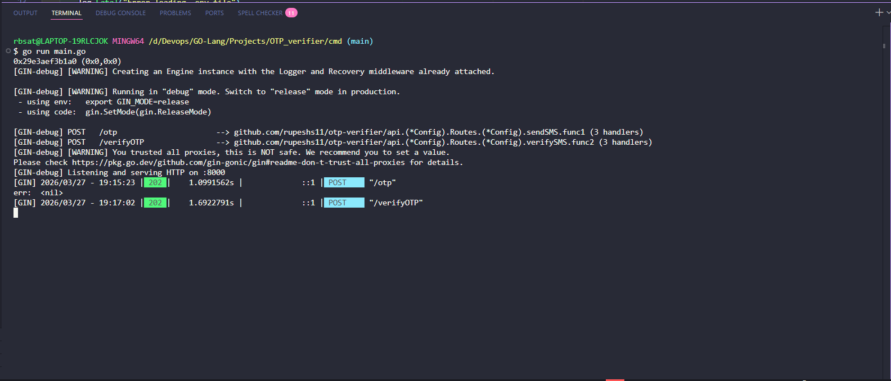

# 🔐 OTP Verifier API

A simple and robust API built with **Go** and the **Gin Framework** for sending and verifying OTPs (One Time Passwords) via SMS using the **Twilio Verify API**.

---

## Architecture & Flow

### 1. OTP API FLOW

```
┌────────────────────┐
│  Gin Router :8000  │
└─────────┬──────────┘
          │
          ├───────────────────────────────────────────────────────────────┐
          │                                                               │
          ▼                                                               ▼

   ┌──────────┐        ┌──────────┐        ┌────────────────┐        ┌──────────────────────┐
   │   POST   │──────▶│   /otp    │──────▶│ sendSMS handler │──────▶│ twilio sendOTP svc  │
   └──────────┘        └──────────┘        └────────────────┘        └──────────────────────┘


   ┌──────────┐        ┌────────────┐      ┌────────────────┐        ┌──────────────────────┐
   │   POST   │──────▶│ /verifyOTP │────▶│ verifySMS handler│──────▶│ verify OTP service   │
   └──────────┘        └────────────┘      └────────────────┘        └──────────────────────┘
```

### 2. API LAYER STRUCTURE

```
┌──────────┐
│   API    │
└────┬─────┘
     │
     ├───────────────┬───────────────┬───────────────┬───────────────┬───────────────┐
     ▼               ▼               ▼               ▼               ▼

┌──────────┐   ┌────────────┐   ┌────────────┐   ┌────────────┐   ┌────────────┐
│ route.go │   │ handler.go │   │ service.go │   │ helper.go  │   │ config.go  │
└──────────┘   └────────────┘   └────────────┘   └────┬───────┘   └────┬───────┘
                                                      │                │
                                                      ▼                ▼

                                            ┌──────────────────┐   ┌────────────────────────────┐
                                            │  jsonResponse    │   │   read env file            │
                                            └────────┬─────────┘   │ (3 functions, 3 values)    │
                                                     │             └────────────────────────────┘
                                                     ▼

                                 ┌────────────────────────────────────────────┐
                                 │ validate body                              │
                                 │ write JSON                                 │
                                 │ error JSON                                 │
                                 └────────────────────────────────────────────┘
```

### 3. PROJECT STRUCTURE (CMD + DATA)

```
┌──────────┐
│   cmd    │
└────┬─────┘
     ▼
┌──────────┐
│ main.go  │
└──────────┘


┌──────────┐
│  data    │
└────┬─────┘
     ▼
┌──────────┐
│ model.go │
└────┬─────┘
     │
     ├───────────────┬───────────────┐
     ▼               ▼

┌────────────┐   ┌────────────┐
│  OTPData   │   │ VerifyData │
└────────────┘   └────────────┘
```

---

## Setup & Configuration

### `.env` Setup

To run this project, you need a Twilio account. Create a `.env` file inside the `cmd/` directory with the following keys:

```ini
# Add these inside cmd/.env
TWILIO_ACCOUNT_SID=your_account_sid_here
TWILIO_AUTHTOKEN=your_auth_token_here
TWILIO_SERVICES_ID=your_verify_service_id_here
```

> **Note:** The API reads these environment variables using `godotenv` in `api/config.go`.

---

## API Endpoints

### 1. Send OTP

- **URL:** `/otp`
- **Method:** `POST`
- **Description:** Sends an OTP to the specified phone number via SMS.
- **Request Body:**
  ```json
  {
    "phoneNumber": "+1234567890"
  }
  ```

### 2. Verify OTP

- **URL:** `/verifyOTP`
- **Method:** `POST`
- **Description:** Verifies the OTP sent to the phone number.
- **Request Body:**
  ```json
  {
    "user": {
      "phoneNumber": "+1234567890"
    },
    "code": "123456"
  }
  ```

---

## Core Components Explained

- **`cmd/main.go`**: Entry point that initializes the Gin router and registers routes.
- **`api/route.go`**: Maps the `/otp` and `/verifyOTP` endpoints to their respective handler functions.
- **`api/handler.go`**: Contains `sendSMS` and `verifySMS`. It validates JSON payloads (using the `validateBody` helper) and orchestrates calls to the Twilio service.
- **`api/service.go`**: Initiates a `twilio.RestClient` and uses the `VerifyV2` API to trigger verification checks and send SMS codes.
- **`data/model.go`**: Defines `OTPData` and `VerifyData` structs used for JSON request parsing and validation.

---

## API Testing (Screenshots)

### API Server Running (CLI)



### Sending OTP Example


### Verifying OTP Example


---

## How to Run

```bash
cd Projects/OTP_verifier

# Install dependencies
go mod tidy

# Change into cmd folder and run
cd cmd
go run main.go
# Server starts at localhost:8000
```

## Dependencies

| Package                                             | Purpose                                               |
| --------------------------------------------------- | ----------------------------------------------------- |
| [`gin-gonic/gin`](https://github.com/gin-gonic/gin) | Fast, lightweight HTTP web framework for Go           |
| [`twilio-go`](https://github.com/twilio/twilio-go)  | Official Twilio Go SDK for sending and verifying OTPs |
| [`godotenv`](https://github.com/joho/godotenv)      | Loads environment variables from `.env` file          |
