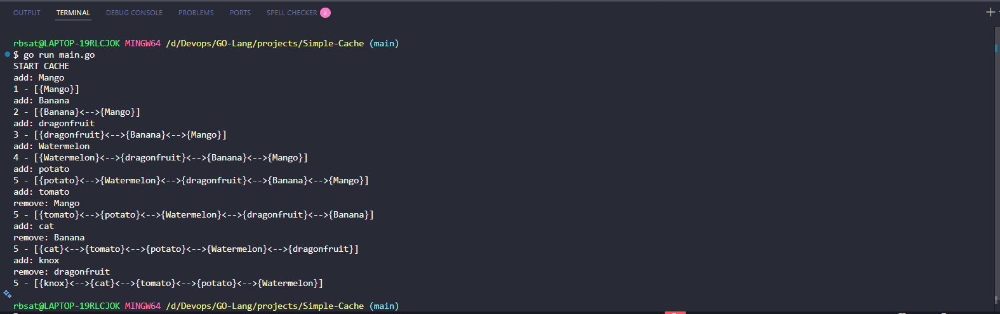

# 🧠 Simple Cache (LRU)

A highly efficient, in-memory **Least Recently Used (LRU) Cache** implementation written from scratch in **Go**. This project demonstrates core computer science data structures by combining a **Doubly Linked List** and a **Hash Map** to achieve $O(1)$ constant time complexity for reads and writes.

---

## 🛠 Features

- **Blazing Fast Operations**: $O(1)$ time complexity for both data retrieval and insertions.
- **Custom Doubly Linked List**: Manages the chronological order of cached items. The most recently used items are kept near the head, while the least recently used fall to the tail.
- **Hash Map Integration**: Provides instantaneous lookups to find specific nodes in the linked list without traversal.
- **Automatic Eviction**: Configured with a max `SIZE` (default is `5`). When the cache reaches capacity, the least recently used item (at the tail) is automatically removed!

---

## 💻 Code Architecture

The implementation uses three primary structures:

### 1. The `Node`

Represents an individual item in the cache.

```go
type Node struct {
    Val   string
    Left  *Node    // Pointer to previous node
    Right *Node    // Pointer to next node
}
```

### 2. The `Queue` (Doubly Linked List)

Maintains the eviction ordering.

```go
type Queue struct {
    Head   *Node   // Dummy head pointer
    Tail   *Node   // Dummy tail pointer
    Length int
}
```

### 3. The `Hash` (Map)

Provides $O(1)$ lookup times.

```go
type Hash map[string]*Node
```

### The `Cache` Structure

Binds the Queue and the Hash together.

```go
type Cache struct {
    Queue Queue
    Hash  Hash
}
```

---

## 🔄 How it Works (`Check` method)

When a new word is checked against the cache (`cache.Check(word)`):

1. **If it exists (Cache Hit)**: The node is found instantly via the `Hash`, removed from its current position in the `Queue`, and re-inserted at the front (head) since it was just used.
2. **If it doesn't exist (Cache Miss)**: A new node is created and inserted at the front.
3. **Eviction**: If inserting causes the `Queue.Length` to exceed the predefined `SIZE`, the node right before the dummy `Tail` (the least recently used) is evicted both from the `Queue` and the `Hash`.

---

## 🚀 How to Run

1. Clone the repository and navigate to the project directory:

   ```bash
   cd Projects/Simple-Cache
   ```

2. Run the application:
   ```bash
   go run main.go
   ```

### 📸 Expected Outcome

As the program loops through an array of words, the cache gracefully shifts data and evicts older words to make room for newer ones.



---

## 📚 Learnings

This project is a perfect demonstration of why **Doubly Linked Lists** are paired with **Hash Maps** when building LRU caches. A standard singly linked list or array would require $O(N)$ operations to find or shift elements, but this combined structure guarantees maximum performance!
