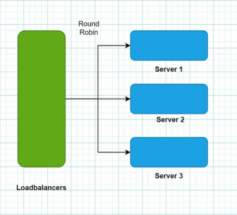
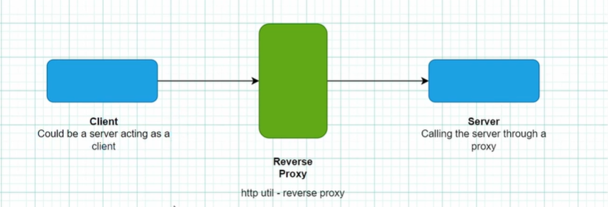
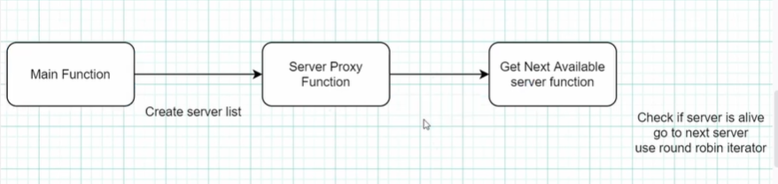
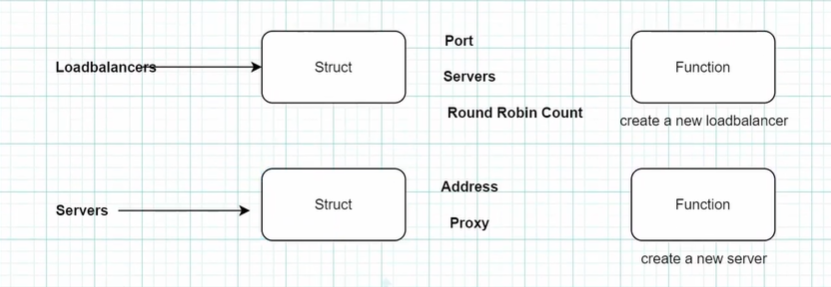

# ⚖️ Simple Load Balancer

A **Round Robin Load Balancer** built in Go using reverse proxies from the standard library. Distributes incoming HTTP requests evenly across multiple backend servers.

## How It Works



Requests arrive at `localhost:8000` and get forwarded to backend servers one by one in a round-robin fashion. If a server is not alive, it skips to the next available one.

## Request Flow



## Architecture

### Reverse Proxy



Each backend server is wrapped with Go's `httputil.ReverseProxy` — it forwards the client's request to the target server and returns the response back.

### Function Implementation



---

## Project Structure

```
Simple-LoadBalancer/
├── src/
│   └── main.go        # Load balancer logic
└── assets/            # Diagrams & images
```

## Key Components

### `Server` Interface

```go
type Server interface {
	Address() string
	IsAlive() bool
	Serve(rw http.ResponseWriter, r *http.Request)
}
```

Any backend must implement these 3 methods — makes it easy to add new server types.

### `simpleServer` — Backend Server with Reverse Proxy

```go
type simpleServer struct {
	addr  string
	proxy *httputil.ReverseProxy
}

func newSimpleServer(addr string) *simpleServer {
	serverUrl, _ := url.Parse(addr)
	return &simpleServer{
		addr:  addr,
		proxy: httputil.NewSingleHostReverseProxy(serverUrl),
	}
}
```

- `httputil.NewSingleHostReverseProxy` creates a reverse proxy that forwards all requests to the target URL
- `Serve()` calls `proxy.ServeHTTP()` to forward the request

### `LoadBalancer` — Round Robin Distribution

```go
type LoadBalancer struct {
	port            string
	roundRobinCount int
	servers         []Server
}

func (lb *LoadBalancer) getNextAvailableServer() Server {
	server := lb.servers[lb.roundRobinCount%len(lb.servers)]
	for !server.IsAlive() {
		lb.roundRobinCount++
		server = lb.servers[lb.roundRobinCount%len(lb.servers)]
	}
	lb.roundRobinCount++
	return server
}
```

- `roundRobinCount % len(servers)` cycles through servers: 0 → 1 → 2 → 0 → 1 → ...
- Skips dead servers automatically

### `main()` — Wiring It Up

```go
servers := []Server{
	newSimpleServer("https://www.facebook.com"),
	newSimpleServer("https://www.google.com"),
	newSimpleServer("https://tourstacks.rf.gd"),
}
lb := NewLoadBalancer("8000", servers)
http.HandleFunc("/", func(rw http.ResponseWriter, req *http.Request) {
	lb.serverProxy(rw, req)
})
http.ListenAndServe(":8000", nil)
```

## How to Run

```bash
cd Projects/Simple-LoadBalancer/src
go run main.go
# Server starts at localhost:8000
# Each request is forwarded to the next backend in rotation
```
