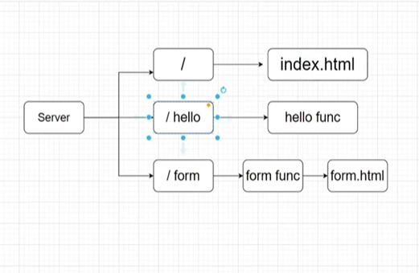

# 🌐 Simple Web Server

A basic HTTP web server built with Go's standard `net/http` package — no external frameworks needed.

## What It Does

| Route    | Method | Description                               |
| -------- | ------ | ----------------------------------------- |
| `/`      | GET    | Serves static HTML files from `./static/` |
| `/hello` | GET    | Returns a simple "hello!" text response   |
| `/form`  | POST   | Handles form submission (name & address)  |

## Flow



## Project Structure

```
simple_web-server/
├── main.go              # Server logic & route handlers
└── static/
    ├── index.html       # Homepage
    └── form.html        # Form page (name + address)
```

## How It Works

### Static File Server

```go
fileServer := http.FileServer(http.Dir("./static"))
http.Handle("/", fileServer)
```

Serves everything inside `./static/` at the root URL. Visiting `localhost/` loads `index.html`.

### Hello Handler

```go
func helloHandler(w http.ResponseWriter, r *http.Request) {
	if r.URL.Path != "/hello" {
		http.Error(w, "404 not found", http.StatusNotFound)
		return
	}
	if r.Method != "GET" {
		http.Error(w, "method is not supported", http.StatusNotFound)
		return
	}
	fmt.Fprintf(w, "hello!")
}
```

- Validates the path and HTTP method manually
- `http.ResponseWriter` writes the response back to the client
- `*http.Request` contains all request info (URL, method, headers, body)

### Form Handler

```go
func formHandler(w http.ResponseWriter, r *http.Request) {
	r.ParseForm()
	name := r.FormValue("name")
	address := r.FormValue("address")
	fmt.Fprintf(w, "Name = %s\naddress = %s\n", name, address)
}
```

- `r.ParseForm()` parses the POST body
- `r.FormValue("name")` extracts form fields by name

### Starting the Server

```go
fmt.Println("starting server at port 80")
http.ListenAndServe(":80", nil)
```

## How to Run

```bash
cd Projects/simple_web-server
go run main.go
```

Then open:

- `http://localhost/` — Homepage
- `http://localhost/hello` — Hello endpoint
- `http://localhost/form` — Form page
