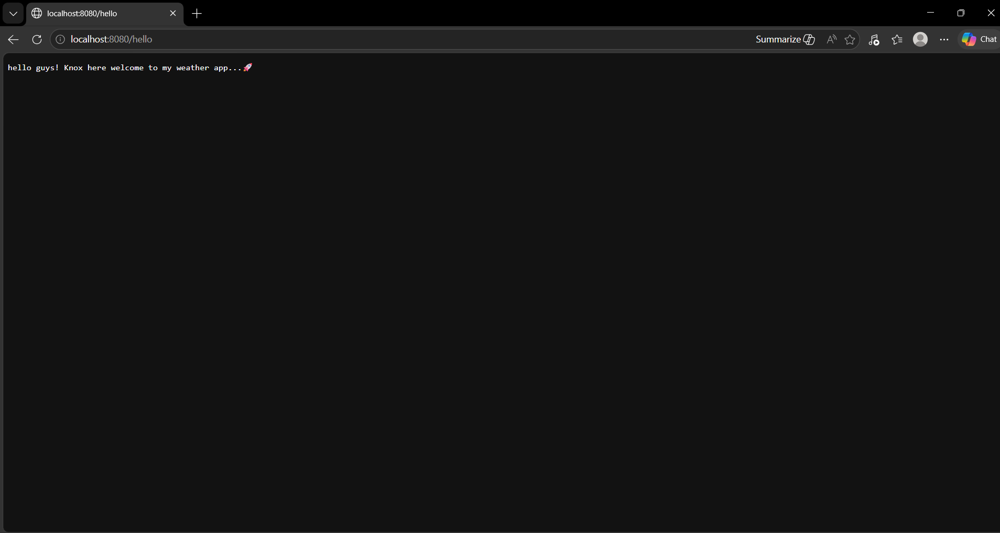
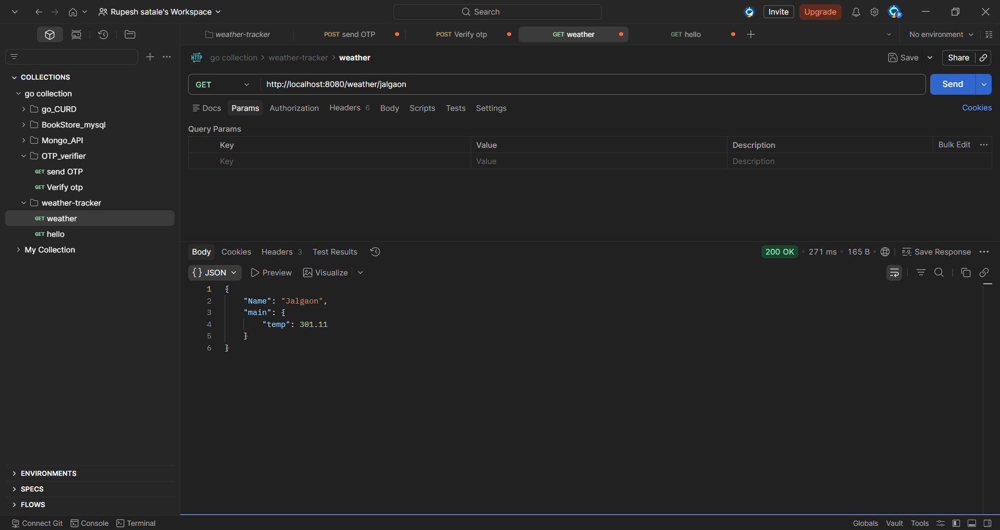
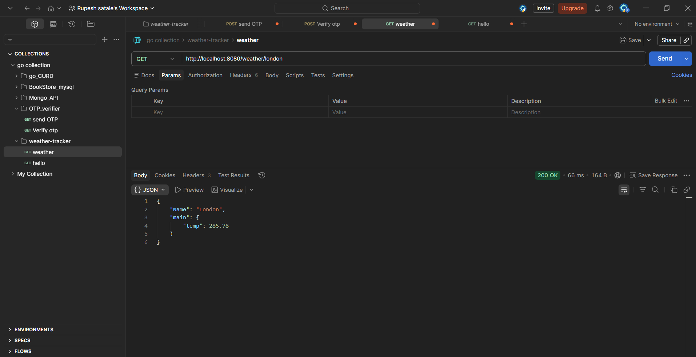
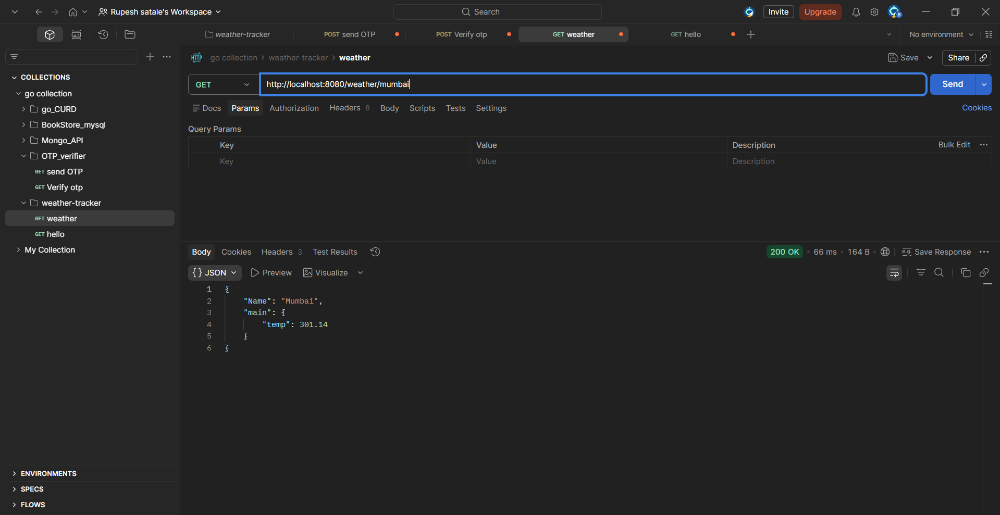

# 🌤️ Go Weather Tracker

A simple web server built with **Go** that acts as an API gateway to seamlessly fetch and serve real-time weather data for any city using the **OpenWeatherMap API**.

---

## 🛠 Features

- **Dynamic Routing**: Exposes a clean endpoint (`/weather/{city}`) that automatically fetches live weather data for the specified city.
- **JSON Configuration**: Keeps sensitive API keys hidden inside an external `.apiConfig` file.
- **Built-in Endpoints**: Includes a welcoming `/hello` endpoint to test server health.
- **Data Filtering**: Uses structured Go Types (`struct`) to isolate precisely the data you need from the massive OpenWeatherMap response payload, delivering lean and concise JSON back to the client.

---

## 💻 Code Explanations

### API Configuration loader

```go
func loadApiConfig(filename string) (apiConfigData, error) {
    bytes, err := os.ReadFile(filename)
    // ... error handling
    var c apiConfigData
    json.Unmarshal(bytes, &c)
    // ...
```

- Reads the local `.apiConfig` JSON file which contains the API Key.
- Parses (Unmarshals) the raw byte data into an `apiConfigData` struct type for secure injection when querying.

### Executing the Request (`query` function)

```go
func query(city string) (weatherData, error) {
    apiConfig, _ := loadApiConfig(".apiConfig")
    resp, _ := http.Get("http://api.openweathermap.org/data/2.5/weather?APPID=" + apiConfig.OpenWeatherMapApiKey + "&q=" + city)
    defer resp.Body.Close()

    var d weatherData
    json.NewDecoder(resp.Body).Decode(&d)
    return d, nil
}
```

- Contacts the external `openweathermap.org` API using Go's built-in `http.Get`.
- Dynamically attaches the configured API key and chosen city.
- Trims the incoming payload using the minimalist `weatherData` struct (ignoring all unwanted fields from the massive raw response) using `json.NewDecoder`.

### Route Setup & String Splitting

```go
http.HandleFunc("/weather/", func(w http.ResponseWriter, r *http.Request) {
    city := strings.SplitN(r.URL.Path, "/", 3)[2]
    data, _ := query(city)
    // ...
    w.Header().Set("Content-Type", "application/json; charset=utf-8")
    json.NewEncoder(w).Encode(data)
})
```

- Serves traffic dynamically without adding external router dependencies.
- Because the route is `/weather/`, passing `/weather/Tokyo` triggers this handler. Using `strings.SplitN`, it slices the path exactly to isolate "Tokyo" bridging it right into our `query` logic!

---

## 🚀 How to Run

1. Clone the repository and navigate to the project directory:

   ```bash
   cd Projects/go-weather-tracker
   ```

2. Create a `.apiConfig` file in the root of the `go-weather-tracker` directory formatted like this:

   ```json
   {
     "OpenWeatherMapApiKey": "YOUR_API_KEY_HERE"
   }
   ```

   _(You can get a free API key by signing up at [OpenWeatherMap](https://openweathermap.org/))_

3. Run the web server:

   ```bash
   go run main.go
   ```

4. Test it via your browser or curl!

### 📸 Test Outcomes

| Endpoints                  | Outcome                                |
| -------------------------- | -------------------------------------- |
| Testing the `/hello` route |   |
| Running `/weather/jalgaon` | |
| Running `/weather/london`  |  |
| Running `/weather/mumbai`  |  |

---

## Dependencies

- **Zero External Dependencies!** Built entirely using the pristine `net/http` and `encoding/json` standard Go packages.
